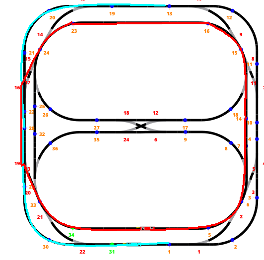

# pco25_lab04
## Section critique 
Comme demandé dans l'énoncé, nous avons implementé les fonctions access, leave, release en prennant en compte le fait que celle si sera utilisée par 2 trains seulement.

Globalement, l'access à la section critique est protegée par le semaphore mutex(qui protege l'access aux differentes variables) et le semaphore semaphore qui va bloquer les threads(locomotives) qui attendent leur tour.

Nous avons mis en place 2 enum class pour 

### Methode access
```c++
        if (&loco == currentLoco || &loco == waitingLoco) {
            errors++;
            mutex.release();
            return;
        }
```
identification de cas d'erreur suivi d'une incrementation puis, et release du mutex
```c++
        bool willBlock = true;
        if (state == State::FREE) { //cas ou section est libre
            state = State::TAKEN;
            currentLoco = &loco;
            currentDirection = d;
            nextFunction = ExpectedFunction::LEAVE;
            willBlock = false;
        } else { //cas ou section n'est pas libre (forcement TAKEN car il y a que 2 loco)
            waitingLoco = &loco;
            waitingDirection = d;
            if (d != currentDirection) { //selection de l'etat en fonction de la direction
                state = State::WAITING_DIFFERENT_D;
            } else {
                state = State::WAITING_SAME_D;
                if (nextFunction == ExpectedFunction::RELEASE) { //si la loco précédente a deja leave la section on peut s'engager
                    willBlock = false;
                    nextFunction = ExpectedFunction::ANY;
                }
            }
        }
```
Ici nous alons identifier les differents cas possibles:
- La section est libre
  - la locomotive s'arrete pas
- La section est prise et la locomotive va dans le meme sens
  - on va verifier si la locomotive précédente a deja appelé leave()
    - si oui la locomotive s'arrete pas 
    - sinon la locomotive va attendre jusqu'à ce que leave soit appelé
- La section est prise et la locomotive va dans le mauvais sens
  - La locomotive va attendre jusqu'a ce que release soit appelé 
```c++
    if (willBlock) {
        loco.arreter();
        semaphore.acquire();    //attente du release ou leave
        mutex.acquire();
        state = State::TAKEN;
        currentLoco = &loco;
        currentDirection = d;
        waitingLoco = nullptr;
        nextFunction = ExpectedFunction::LEAVE;
        loco.demarrer();
        mutex.release();
    }
  ```
Dans ce bloc nous allons bloquer la locomotive si elle se trouve dans un des cas cités avant.

On va ensuite attendre que le semaphore soit released pour ensuite reprendre la main sur la section

### Methode leave
```c++
    if (waitingLoco != &loco && currentLoco != &loco) {
        errors++;
        mutex.release();
        return;
    }
    if (waitingLoco == &loco && waitingDirection != d) {
        errors++;
        mutex.release();
        return;
    }
    if (currentLoco == &loco && currentDirection != d) {
        errors++;
        mutex.release();
        return;
    }
    if (nextFunction != ExpectedFunction::LEAVE && nextFunction != ExpectedFunction::ANY) {
        errors++; //erreur d'ordre mais on continue le programme
    }
```
la fonction leave comment avec une verification des erreurs suivantes:
- que la locomotive soit ni celle qui attend ni celle qui est dessus
- que la direction corresponde pas à celle qui a été donnée dans le access
- que la expected function soit soit leave ou any (celle ci fait incrementer les erreurs mais ne quitte pas la fonction)
```c++
    nextFunction = ExpectedFunction::RELEASE; 
    if (state == State::WAITING_SAME_D) {
        if (currentLoco == &loco && currentDirection == d) {
            semaphore.release();
        }
        nextFunction = ExpectedFunction::ANY;// any car on ne sais pas quelle loco arrivera à un point en premier
    } else if (state == State::WAITING_DIFFERENT_D) {
        // encore plus de verification d'erreurs
        if (&loco == waitingLoco) {
            errors++;
            mutex.release();
            return;
        }
        if (currentLoco != &loco) {
            errors++;
            mutex.release();
            return;
        }
        if (currentDirection != d) {
            errors++;
            mutex.release();
            return;
        }
        //semaphore will be released when the first loco calls release
    }
```
Ensuite nous allons gérer les cas ou il y' a une locomotive qui attend:
- si la loco va dans le meme sens, on va release le semaphore pour qu'elle puisse passer
- si la loco va pas dans le meme sens nous allons alors refaire un controlle d'erreur (le semaphore sera libéré dans la methode release)

### Methode release
```c++
    if (waitingLoco != &loco && currentLoco != &loco) {
        errors++;
        mutex.release();
        return;
    }
    if (nextFunction != ExpectedFunction::RELEASE && nextFunction != ExpectedFunction::ANY) {
        errors++;
    }
```
Comme dit avant, nous commençons notre methode avec des vérification d'erreurs
```c++
    switch (state) {
        case State::WAITING_DIFFERENT_D:
            semaphore.release();
            break;
        case State::WAITING_SAME_D:
            state = State::TAKEN;
            currentLoco = waitingLoco;
            currentDirection = waitingDirection;
            waitingLoco = nullptr;
            nextFunction = ExpectedFunction::ANY;
            break;
        case State::TAKEN:
            if (currentLoco == &loco) {
                state = State::FREE;
                nextFunction = ExpectedFunction::ACCESS;
                currentLoco = nullptr;
            }
            break;
        default:
            break;
    }
```
Nous allons passer dans un switch case en fonction de l'etat actuel:
- cas ou il y a une locomotive qui attend dans le sens inverse
  - on release le semaphore
- cas ou il y a une locomotive qui attend dans le meme sens
  - on la donne la main et on mets next function à any (car il se peut que la loc soit deja au dela du point de release)
- cas ou il y a pas de locomotive qui attend
  - on libere la ligne
### Methode stopall
celle a comme but de bloquer toutes les locomotives qui essayent d'accéder la section critique
```c++
void stopAll() override {
        mutex.acquire();
        state = State::CLOSED;
        mutex.release();
    }
```
pour ceci nous allons juste changer l'état en "CLOSED"
```c++
  if (state == State::CLOSED) {
      mutex.release();
      semaphore.acquire();
      mutex.acquire();
  }
```
dans la fonction access nous allons du coup faire un check de l'etat pour ensuite bloquer toutes les locomotives qui appellent cette fonction

## Mise en place du programme
Dans un premiere temps, nous avons établi les differentes routes pour les deux trains.

Nous sommes arrivées a celle-ci:
- la locomotive rouge qui fait un parcours circulaire 
- la locomotive bleu fait un parcour lineare, elle change son sens apres avoir atteint les points 13 et 1
- la section partagée est composée donc des points 26 et 22
- L'aiguillage 16 doit changer d'etat en fonction de la locomotive qui passe dessus
  - Tout-droit si c'est la locomotive bleu qui passe
  - dévié si c'est la locomotive rouge qui passe
### LocomotiveBehavior
```c++
  inline static const std::array<int, 10> ROUTEBLUE = {1, 31, 30, 29, 28, 22, 21, 20, 19, 13};
  inline static const std::array<int, 12> ROUTERED = {5, 34, 33, 28, 22, 24, 23, 16, 15, 14, 7, 6};
  inline static const std::array<int, 2> SECTIONCRITIQUEBLUE = {30, 20};
  inline static const std::array<int, 2> SECTIONCRITIQUERED = {34, 23};
  static const int LEAVESECTIOND1 = 22;
  static const int LEAVESECTIOND2 = 28;
  inline static const std::array<int, 2> SWITCHESBLUE = {1, 13};
  static const int AGUILLAGETRIGGER = 22;
  static const int AGUILLAGE = 16;
```
nous avons commencé par modeliser les differentes informations dites précédement pour quelles puissent etre utilisées par le code qui suit

```c++
    int index = 1;              //index pour savoir ou la loc se dirige
    int incrementor = 1;        //variable avec laquelle on va affecter index (positif pour d1 negatif pour d2)
    SharedSectionInterface::Direction dir = SharedSectionInterface::Direction::D1; // D1 pour sens de la montre 
```
Dans la methode run nous allons du coup déclarer quelques varibales pour nous aider avec les differents threads

La boucle infinie est divisée en deux parties, une pour chaque loc nous permettant de gérer les differentes particularitées de fonctionnement entre les deux.

```c++
  if (&locoA == &loco) {
      // red
      attendre_contact(ROUTERED[index]);
      if (ROUTERED[index] == SECTIONCRITIQUERED[0]) {
          sharedSection->access(loco, dir);
      }
      if (ROUTERED[index] == LEAVESECTIOND1) {
          sharedSection->leave(loco, dir);
      }
      if (ROUTERED[index] == SECTIONCRITIQUERED[1]) {
          sharedSection->release(loco);
      }
  
      if (ROUTERED[index] == AGUILLAGETRIGGER) {
          diriger_aiguillage(16, DEVIE, 0);
      }
      index = (index + incrementor) % ROUTERED.size();
  }
```
Le bloc pour la locomotive rouge est plutot simple, il ya les verifications suivantes:
- si le contacte est l'entrée de la section critique
  - on fait access
- si c'est la fin de la zone partagée
  - on fait leave
- si c'est la fin de la section critique
  - on fait release
- si on est sur le contacte 22 (celui avant l'aiguillage)
  - on dirige l'aguillage 16 en mode dévié
apres ces verifications, on va ensuite incrémenter index en faisant un modulo pour que il depasse pas le nombre de contactes dans la route
```c++
    // blue
    attendre_contact(ROUTEBLUE[index]);
    if (ROUTEBLUE[index] == SECTIONCRITIQUEBLUE[0]) {
        if (dir == SharedSectionInterface::Direction::D1) {
            sharedSection->access(loco, dir);
        } else {
            sharedSection->release(loco);
        }
    }
    if (ROUTEBLUE[index] == SECTIONCRITIQUEBLUE[1]) {
        if (dir == SharedSectionInterface::Direction::D1) {
            sharedSection->release(loco);
        } else {
            sharedSection->access(loco, dir);
        }
    }

    if (dir == SharedSectionInterface::Direction::D1) {
        if (ROUTEBLUE[index] == LEAVESECTIOND1) {
            sharedSection->leave(loco, dir);
        }
    } else {
        if (ROUTEBLUE[index] == LEAVESECTIOND2) {
            sharedSection->leave(loco, dir);
        }
    }
    //changement de sens
    if (ROUTEBLUE[index] == ROUTEBLUE.back()) {
        loco.inverserSens();
        dir = SharedSectionInterface::Direction::D2;
        incrementor = -1;
    }
    if (ROUTEBLUE[index] == ROUTEBLUE[0]) {
        loco.inverserSens();
        dir = SharedSectionInterface::Direction::D1;
        incrementor = 1;
    }
    //direction d'aiguillage
    if (ROUTERED[index] == AGUILLAGETRIGGER) {
        diriger_aiguillage(AGUILLAGE, TOUT_DROIT, 0);
    }
    index += incrementor;
```
Le bloc bleu suit la meme logique que le bloc rouge mais en prennant en compte le fait qu'il puisse aller dans le sens contraire

Nous avons du coup 2 vérifications supplémentaires pour l'inversion de sens suivis par un changement de la variable dir et increment